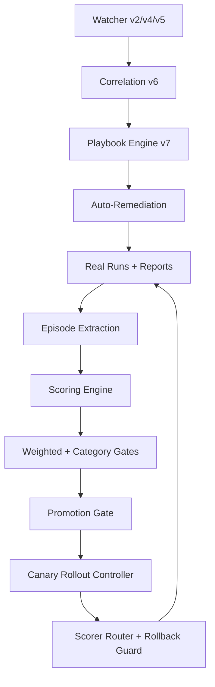

# OpenClaw Enterprise Autonomy Stack

Enterprise-grade autonomous operations framework built on top of native OpenClaw architecture.

## What this repository delivers

- **Memory + ART convergence loop** (integrity scoring, category gates, weighted scoring)
- **Safe rollout controls** (canary promotion, rollback guards, baseline protection)
- **Watcher stack v1-v7** (state detection -> semantic detection -> correlation -> self-healing playbooks)
- **Proactive operations layer** (daily digest, automation opportunity mining, ROI reporting)
- **Lean-mode hardening** (retention cleanup, run caps, reduced cron frequency)

---

## Architecture (high-level)

---

## Core capabilities

### 1) Reliability Guardrails
- Baseline vs candidate evaluation
- Promotion only on measurable improvement
- Automatic rollback on regression
- Category coverage enforcement

### 2) Memory Hardening
- Entity-first memory structure
- Integrity scoring and contradiction checks
- Archive rotation + shard-aware indexing

### 3) Proactive Operations
- Daily ops digest
- Automation opportunity miner
- Outcomes/ROI report + roadmap auto-prioritizer

### 4) Incident Intelligence
- Semantic change impact scoring
- Cross-signal incident correlation
- Tiered escalation (log / digest / immediate)
- Self-healing incident playbooks with circuit breaker

---

## Orchestration

See [`orchestration/cron-blueprint.md`](orchestration/cron-blueprint.md) for deployable cron topology.

See [`orchestration/runbook.md`](orchestration/runbook.md) for incident operations and rollback procedures.

## Visual Architecture

The architecture and rollout state diagrams are documented in [`docs/ARCHITECTURE.md`](docs/ARCHITECTURE.md).

---

## Enterprise controls

- **Safe-by-default:** only `safe=true` actions auto-execute
- **Circuit breaker:** max failures + cooldown windows
- **Noise suppression:** debounce + confidence tuning + retention cleanup
- **Auditability:** change logs, promotion history, playbook audit trails

---

## Repository map

- `docs/ARCHITECTURE.md` — diagrams + system design
- `orchestration/` — cron topology + operational runbooks
- `showcase/IMPLEMENTATION_TRAIL.md` — shipped milestone trail
- `showcase/OUTCOMES_BEFORE_AFTER.md` — before/after impact summary

## Quick Links

- Executive Summary: [`showcase/EXECUTIVE_SUMMARY.md`](showcase/EXECUTIVE_SUMMARY.md)
- Architecture: [`docs/ARCHITECTURE.md`](docs/ARCHITECTURE.md)
- Current Status: [`docs/STATUS.md`](docs/STATUS.md)
- Cron Blueprint: [`orchestration/cron-blueprint.md`](orchestration/cron-blueprint.md)
- Runbook: [`orchestration/runbook.md`](orchestration/runbook.md)
- Disaster Recovery: [`orchestration/DISASTER_RECOVERY.md`](orchestration/DISASTER_RECOVERY.md)
- Outcomes: [`showcase/OUTCOMES_BEFORE_AFTER.md`](showcase/OUTCOMES_BEFORE_AFTER.md)
- 2-Min Demo: [`showcase/DEMO_2_MINUTES.md`](showcase/DEMO_2_MINUTES.md)
- Security: [`SECURITY.md`](SECURITY.md)

---

## License

MIT
