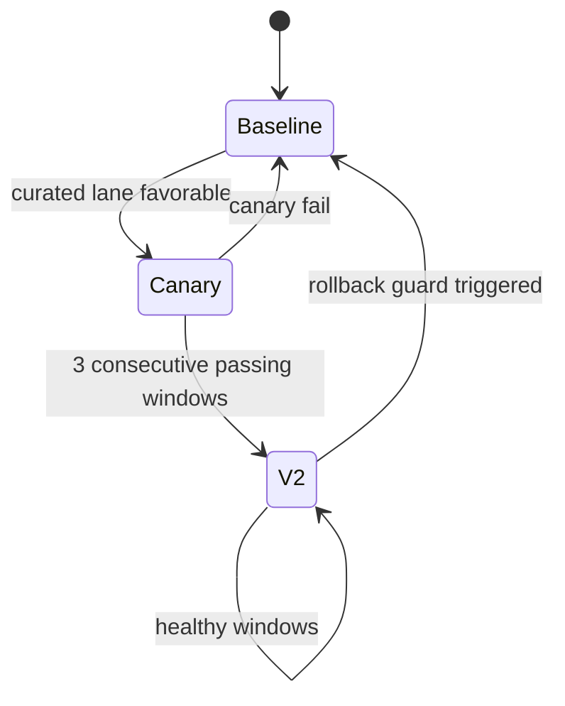

# Architecture

## System Overview

```mermaid
flowchart LR
  A[User Requests + Cron Events] --> B[OpenClaw Agent Runtime]
  B --> C[Memory Layer\n(builtin + memory-core + qmd)]
  B --> D[ART Quality Loop\n(score -> gate -> rollout)]
  B --> E[Watcher Stack v1-v7\n(detect -> correlate -> heal)]

  C --> D
  D --> E
  E --> F[Playbooks + Auto-Remediation]
  F --> B

  D --> G[Release Health + ROI Reports]
  E --> G
  C --> G
```

## Rollout Safety Model



## Watcher Evolution

- v1: basic state changes
- v2: severity + debounce
- v3: action engine (safe rules)
- v4: adaptive tuning + prune
- v5: semantic impact detection
- v6: cross-signal correlation
- v7: incident playbooks + circuit breaker
